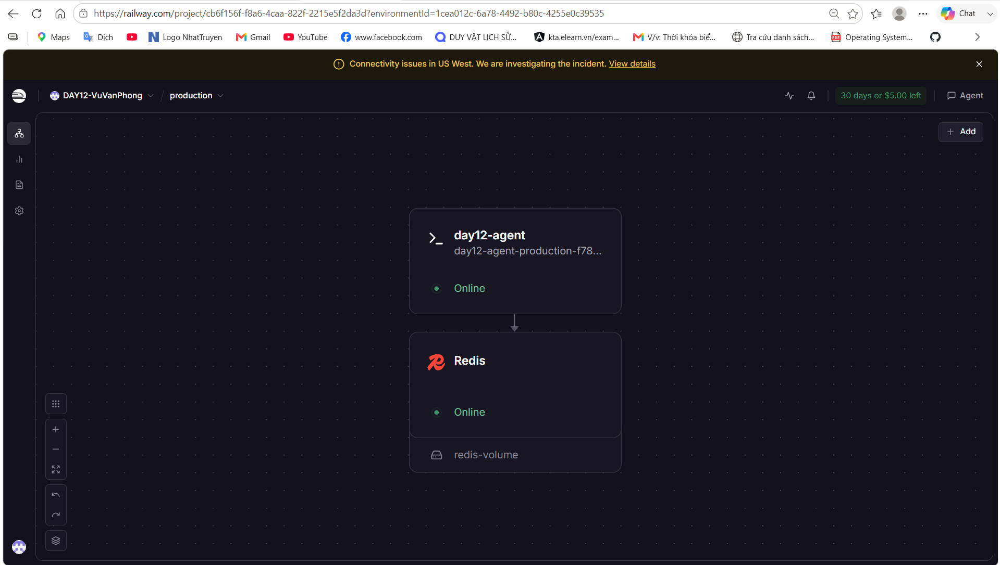
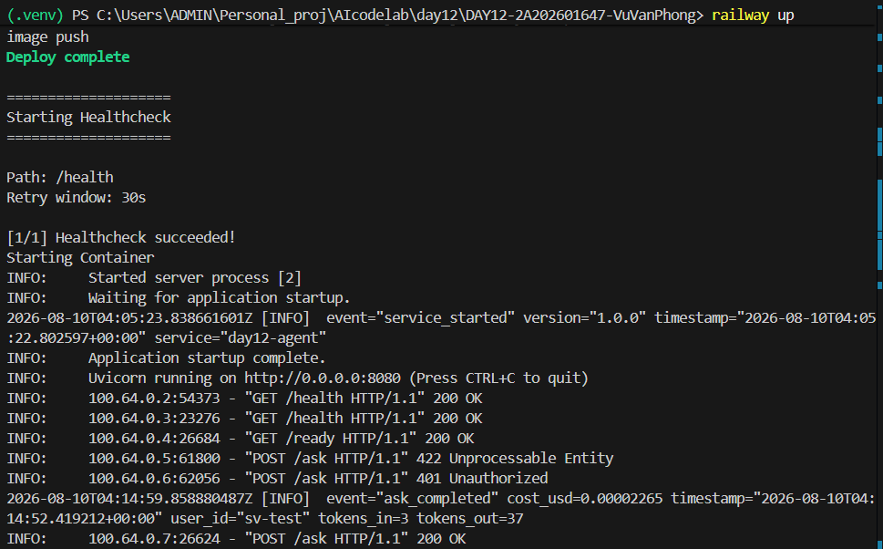

# Deployment Report — Checkpoint 5

Deployment CP5 đã hoàn thành và được xác minh trên Railway. Repository này
không ghi giá trị secret.

## Thông Tin Học Viên và Repository

| Mục | Nội dung |
|-----|----------|
| Họ và tên | Vũ Văn Phong |
| Mã học viên | 2A202601647 |
| Repo name | `K3-DAY12-2A202601647-VuVanPhong` |
| Repo URL | https://github.com/VuVanPhong123/K3-DAY12-2A202601647-VuVanPhong |

## Service

| Mục | Nội dung |
|-----|----------|
| Public URL | https://day12-agent-production-f780.up.railway.app |
| Platform | Railway |
| Ngày deploy | 2026-08-10 |

## Biến Môi Trường

Chỉ ghi tên biến và trạng thái; các giá trị secret được giữ trong Railway.

| Biến | Trạng thái |
|------|------------|
| `AGENT_API_KEY` | Đã set trên Railway |
| `REDIS_URL` | Đã kết nối Railway Redis |
| `RATE_LIMIT_PER_MINUTE` | `10` |
| `MONTHLY_BUDGET_USD` | `10.0` |
| `LOG_LEVEL` | `INFO` |
| `PORT` | Do Railway cung cấp |

## Kết Quả Đã Xác Minh

```text
GET /health -> 200 {"status":"ok","service":"day12-agent","version":"1.0.0"}
GET /ready -> 200 {"status":"ready","redis":true}
POST /ask without API key -> authentication enforced
Railway deployment -> SUCCESS
```

Base URL dùng cho smoke test:

```bash
BASE_URL="https://day12-agent-production-f780.up.railway.app"
```

## Cấu Hình và Evidence

`railway.toml` dùng Dockerfile builder, healthcheck `/health`, timeout/restart
policy hiện tại và không có custom `startCommand`.



